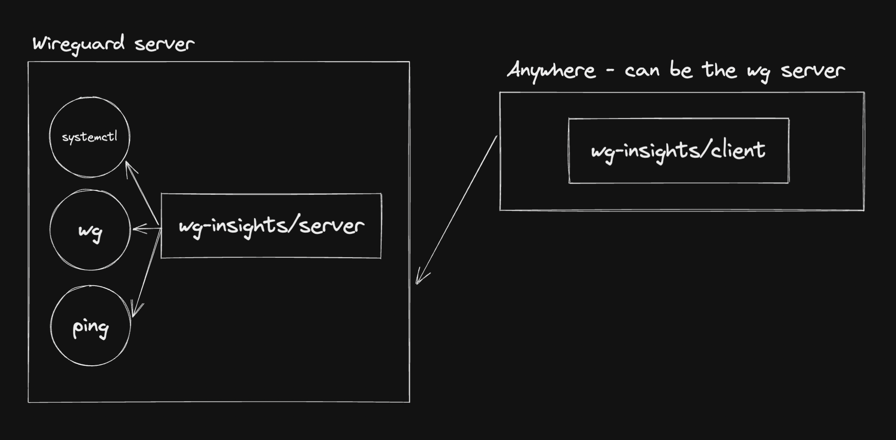

# 🐉 Wireguard Insights

A self-hosted Wireguard administration tool that can be accessed through HTTP API or a Web-based portal for managing Wireguard server and clients.

This HTTP portal uses `wg` command under the hood to make changes to the wireguard servser and its peers.

## Features

- 🔐 Secure authentication
- 📊 Real-time Wireguard systemctl status, Google and CloudFlare ping, server resources statistics
- 💾 Create, read, update and delete clients
- 🔌 Real-time client connection status and statistics 
- ✅ Compatible with the widely used `wireguard-install.sh` script
- 📄 Serving client configuration in file and QR code format
- 🎒 Backup methods for Wireguard server configuration

## Prerequisites

make sure you have wiregaurd installed on your machine.

## Installation



Install `wg-insights/server` on the same server you have Wireguard running, then run the `wg-insights/client` anywhere you want by passing the correct `VITE_HTTP_BASE_URL` to it.

### Docker

```BASH
docker build -t wireguard-insights ./
```
### PM2

```BASH
cd client && pm2 start --name wg-insights/client pnpm -- prod
```

```BASH
cd server && pm2 start --name wg-insights/server yarn -- start
```